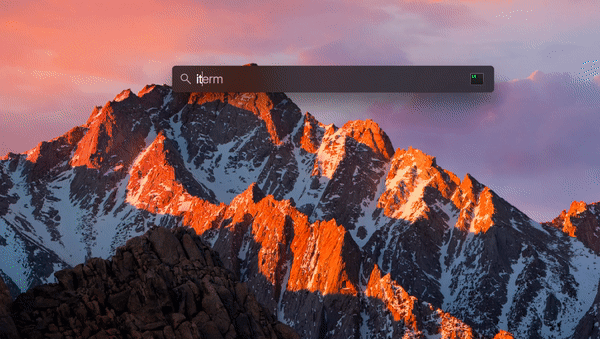

# xcode-install-guide

### MacOS Sierra

### Xcode esta instalado?

1. Abrimos `Terminal` o `iTerm` con el comando `command + tab`:




Verificar si tenemos la version completa de Xcode package instalada:

```
$ xcode-select -p
```

Si vemos la siguiente linea en terminal:
```
/Applications/Xcode.app/Contents/Developer
```


Ya tenemos en code instalado. Si no es el caso lo intalamos ejecutandio lo siguiente:
```
$ xcode-select --install
```
